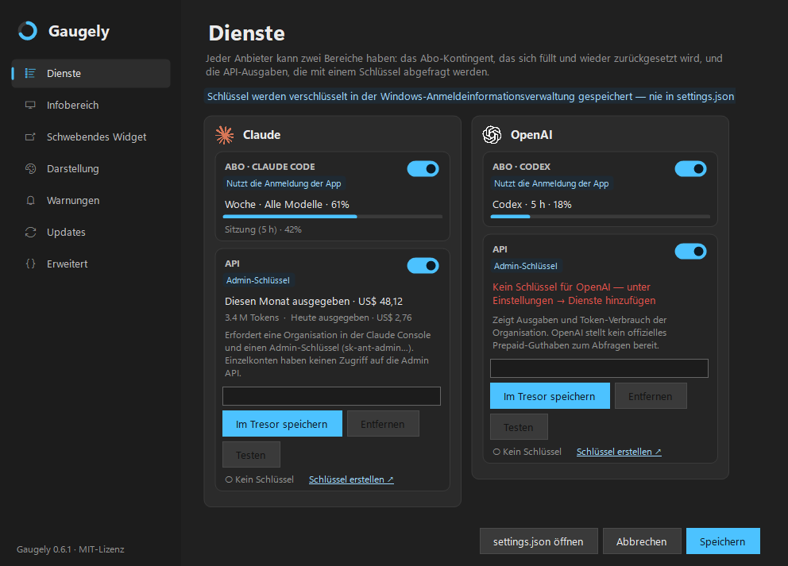

# Gaugely

Nutzungslimits und API-Ausgaben deiner KI-Werkzeuge, live im Windows-Infobereich.

Gaugely zeigt, wie viel von jedem Abo übrig ist — Claude Code, Codex, Kimi Code und Google
Antigravity — und was du für die APIs von Anthropic, OpenAI, Kimi, OpenRouter und DeepSeek
ausgibst, als Symbole im Infobereich und auf Wunsch als schwebende Leiste mit Anzeigen. So siehst
du ein Limit kommen, bevor es dich mitten in der Arbeit stoppt.

Gaugely ist ein Fork von **[RateTray](https://github.com/nowrap/rate-tray)** von nowrap, unter
der MIT-Lizenz. Die Abfragelogik, die Symbole, das Detailfenster und das meiste, was die App
ausmacht, stammen von dort. Dank und Anerkennung gehen an das ursprüngliche Projekt.



*[English version](README.md)*

## Was der Fork ergänzt

- **Zwei Bereiche pro Anbieter.** Das Abo-Kontingent, das sich füllt und zurückgesetzt wird, und
  — mit einem API-Schlüssel — was dich die API gekostet hat:

  | Anbieter | Abo | API |
  |---|---|---|
  | Claude | Claude Code (5-Stunden- und Wochenfenster) | Anthropic Admin API: Ausgaben diesen Monat und heute, Tokens — erfordert eine Organisation und einen Admin-Schlüssel |
  | OpenAI | Codex | OpenAI Admin API: Ausgaben diesen Monat und heute, Tokens und Anfragen — ein offizielles Prepaid-Guthaben gibt es nicht |
  | Google | AI-Pro-Kontingente, gelesen über die lokale `agy`-CLI (Antigravity) | nicht verfügbar: Google meldet Ausgaben nur über Cloud Billing |
  | Kimi | Kimi Code (5-Stunden- und Wochenfenster) | Guthaben der Kimi-Plattform (ein Plattform-Schlüssel, nicht der von Kimi Code) |
  | OpenRouter | — | Guthaben, Ausgaben heute, diese Woche und diesen Monat |
  | DeepSeek | — | Guthaben |

- **Ein Einstellungsfenster für alles.** Seitenleiste mit Dienste, Infobereich, Schwebendes
  Widget, Darstellung, Warnungen, Updates und Erweitert; hell und dunkel. Alles, was man
  üblicherweise ändert, ist dort — nur die festen Claude-Endpunktpfade und die Client-ID bleiben in
  der Datei — und `settings.json` funktioniert weiterhin: Änderungen an
  der Datei gelten, während die App läuft, und eine ungültige Datei wird ignoriert, bis sie wieder
  gültig ist.
- **Im Fenster eingefügte API-Schlüssel landen nur in der Windows-Anmeldeinformationsverwaltung**,
  nie in `settings.json`. Die Schaltfläche **Testen** fragt den Dienst sofort ab.
- **11 Sprachen**: Englisch, Deutsch, Portugiesisch (Brasilien), Spanisch, Französisch,
  Italienisch, Russisch, Arabisch (von rechts nach links), Chinesisch (vereinfacht), Japanisch
  und Koreanisch.
- **Ein Symbol pro Dienst.** Der Infobereich zeigt das Limit, das zuerst ausläuft; die Karte beim
  Überfahren zeigt die Limits dieses Dienstes.
- **Schwebende Leiste.** Ein Ring pro Dienst, immer im Vordergrund, waagerecht oder senkrecht,
  in der Größe veränderbar, mit einem *Notch*-Modus, der sie bündig an einen Bildschirmrand setzt.
- **Härtung** — siehe [SECURITY.md](SECURITY.md):
  - **FORK-1** — die Claude-Endpunkte für Nutzung und Token lassen sich über `settings.json` nicht
    auf einen anderen Host umlenken; ein fremder Host fällt auf den offiziellen zurück.
  - **FORK-2** — es gibt keine Einstellung dafür, welche `codex.exe` gestartet wird; die App findet
    sie selbst.
  - **FORK-3** — die automatische Erneuerung des Claude-Tokens ist als Opt-in erlaubt, aber nur
    gegenüber dem offiziellen Host.
  - Anfragen mit Schlüssel oder Token folgen nie Weiterleitungen und lehnen übergroße Antworten ab.
- **Updates aus den Releases dieses Repositorys**, vor dem Anwenden geprüft — siehe unten.

## Installation

1. Installiere die [.NET 9 Desktop Runtime](https://dotnet.microsoft.com/download/dotnet/9.0), falls
   sie fehlt.
2. Lade `Gaugely.exe` und `SHA256SUMS.txt` aus dem
   [neuesten Release](https://github.com/kimmansur/gaugely/releases/latest) herunter.
3. Prüfe den Hash, bevor du die Datei startest:

   ```powershell
   Get-FileHash Gaugely.exe -Algorithm SHA256
   ```

   Der Hash muss dem in der Zeile `Gaugely.exe` der `SHA256SUMS.txt` entsprechen. Weicht er ab,
   starte die Datei nicht.

4. Lege sie in einen eigenen Ordner — nicht in „Downloads“ — und starte sie. Setze im Menü des
   Infobereichs den Haken bei **Mit Windows starten**, wenn sie bei der Anmeldung starten soll.
5. Rechtsklick auf das Symbol im Infobereich → **Einstellungen…**, um Dienste ein- oder
   auszuschalten und API-Schlüssel hinzuzufügen.

## Updates

Standardmäßig aus. Unter **Einstellungen → Updates** oder in **Über Gaugely** kannst du Gaugely
dieses Repository einmal täglich prüfen lassen. Gibt es ein neueres Release, erscheint eine
Benachrichtigung, und **Über Gaugely → Herunterladen und installieren** holt es.

Bevor etwas ersetzt wird, prüft das Installationsprogramm drei Dinge: Der Download stammt aus den
Release-Dateien dieses Repositorys, sein SHA256 stimmt mit der `SHA256SUMS.txt` des Releases
überein, und die in der ausführbaren Datei eingetragene Version entspricht dem Release-Tag. Der
Austausch ist ein einziger `ReplaceFile`-Aufruf, und die vorherige Version bleibt als
`Gaugely.exe.old` erhalten, bis die neue startet.

Was das **nicht** beweist, ist, wer das Release veröffentlicht hat — die Prüfsumme liegt im selben
Release wie die Datei. Deshalb braucht die Installation immer einen Klick und geschieht nie von
selbst.

## Umstieg von RateTray

Beim ersten Start kopiert Gaugely deine `%APPDATA%\RateTray\settings.json`, übernimmt die Kimi-
und OpenRouter-Schlüssel früherer Builds des Forks und übernimmt einen vorhandenen Eintrag
**Mit Windows starten**. Die alten Dateien bleiben liegen; zurück geht es also einfach, indem man
die alte Datei startet.

## Probleme und Ideen

Eröffne ein [Issue](https://github.com/kimmansur/gaugely/issues). Gib die Gaugely-Version (aus
„Über Gaugely“), deine Windows-Version und, falls ein Dienst einen Fehler zeigt, dessen Text an.
Bitte füge keine Tokens, API-Schlüssel oder Inhalte deiner Anmeldedateien ein.

Sicherheitsprobleme bitte über [SECURITY.md](SECURITY.md) melden.

## Bauen

```powershell
dotnet test tests/RateTray.Tests/RateTray.Tests.csproj
dotnet publish src/RateTray/RateTray.csproj -c Release -r win-x64 -o publish
```

Projektordner und Namensräume behalten absichtlich die Namen `RateTray` des Originals, damit sich
Korrekturen aus dem ursprünglichen Projekt weiterhin übernehmen lassen.

## Lizenz

MIT — siehe [LICENSE](LICENSE). Der ursprüngliche Copyright-Vermerk von RateTray ist dort erhalten.
Material Dritter und Marken sind in [THIRD-PARTY-NOTICES.md](THIRD-PARTY-NOTICES.md) aufgeführt.
