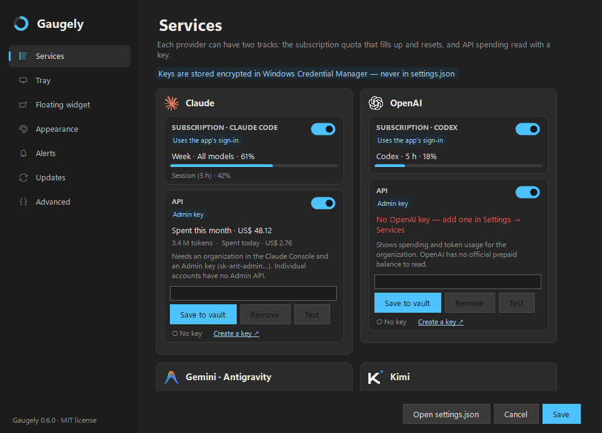

# Gaugely

Live usage limits and API spending for your AI tools, in the Windows tray.

Gaugely shows how much is left of each subscription — Claude Code, Codex, Kimi Code and Google
Antigravity — and what you are spending on the APIs of Anthropic, OpenAI, Kimi, OpenRouter and
DeepSeek, as tray icons and as an optional floating strip of gauges, so you see a limit coming
before it stops you mid-task.

It is a fork of **[RateTray](https://github.com/nowrap/rate-tray)** by nowrap, released under the
MIT license. The polling engine, the tray icons, the details window and most of what makes it
work come from there. Credit and thanks go to the original project.



*[Deutsche Version](README.de.md)*

## What the fork adds

- **Two tracks per provider.** The subscription quota that fills up and resets, and — with an
  API key — what the API has cost you:

  | Provider | Subscription | API |
  |---|---|---|
  | Claude | Claude Code (5-hour and weekly windows) | Anthropic Admin API: spend this month and today, tokens — needs an organization and an Admin key |
  | OpenAI | Codex | OpenAI Admin API: spend this month and today, tokens and requests — no official prepaid balance exists |
  | Google | AI Pro quotas, read from the local `agy` CLI (Antigravity) | not available: Google reports spend only through Cloud Billing |
  | Kimi | Kimi Code (5-hour and weekly windows) | Kimi platform balance (a platform key, not the Kimi Code key) |
  | OpenRouter | — | Credit balance, spend today, this week and this month |
  | DeepSeek | — | Balance |

- **A settings window for everything.** Sidebar with Services, Tray, Floating widget,
  Appearance, Alerts, Updates and Advanced; light and dark. Every option in `settings.json` can be
  changed there, and `settings.json` still works: edits to the file apply while the app runs, and
  an invalid file is ignored until it is valid again.
- **API keys pasted in the window go only to the Windows Credential Manager**, never to
  `settings.json`. A **Test** button reads the service on the spot.
- **11 languages**: English, German, Portuguese (Brazil), Spanish, French, Italian, Russian,
  Arabic (right to left), Chinese (Simplified), Japanese and Korean.
- **One icon per service.** The tray shows the limit that will run out first; the hover card
  shows that service's limits.
- **Floating strip.** A ring per service, always on top, horizontal or vertical, resizable, with a
  *notch* mode that docks it flush against a screen edge.
- **Hardening** — see [SECURITY.md](SECURITY.md):
  - **FORK-1** — the Claude usage and token endpoints cannot be pointed at another host from
    `settings.json`; a foreign host falls back to the official one.
  - **FORK-2** — there is no setting for which `codex.exe` runs; the app finds it itself.
  - **FORK-3** — automatic Claude token refresh is allowed as an opt-in, but only ever towards
    the official host.
  - Requests that carry a key or token never follow redirects and refuse oversized responses.
- **Updates from this repository's releases**, verified before they are applied — see below.

## Install

1. Install the [.NET 9 Desktop Runtime](https://dotnet.microsoft.com/download/dotnet/9.0) if you
   do not have it.
2. Download `Gaugely.exe` and `SHA256SUMS.txt` from the
   [latest release](https://github.com/kimmansur/gaugely/releases/latest).
3. Check the hash before running it:

   ```powershell
   Get-FileHash Gaugely.exe -Algorithm SHA256
   ```

4. Put it in a folder of its own — not your Downloads — and start it. Tick
   **Start with Windows** in the tray menu if you want it at logon.
5. Right-click the tray icon → **Settings…** to turn services on or off and to add API keys.

## Updates

Off by default. In **Settings → Updates** or in **About**, you can let Gaugely check this
repository once a day. When a newer
release exists you get a notification, and **About → Download and install** fetches it.

Before anything is replaced, the installer checks three things: the download comes from this
repository's release assets, its SHA256 matches the release's `SHA256SUMS.txt`, and the version
written inside the executable matches the release tag. The swap is a single `ReplaceFile` call,
and the previous version is kept as `Gaugely.exe.old` until the new one starts.

What this does **not** prove is who published the release — the checksum lives in the same
release as the binary. That is why installing always takes a click and never happens on its own.

## Coming from RateTray

On first start Gaugely copies your `%APPDATA%\RateTray\settings.json`, picks up the Kimi and
OpenRouter keys saved by the fork's earlier builds, and moves an existing **Start with Windows**
entry over to itself. The old files are left in place, so going back is just starting the old
executable.

## Problems and ideas

Open an [issue](https://github.com/kimmansur/gaugely/issues). Include the Gaugely version (from
About), your Windows version and, if a service shows an error, the text of that error. Please do
not paste tokens, API keys or the contents of your credential files.

Security problems go through [SECURITY.md](SECURITY.md) instead.

## Build

```powershell
dotnet test tests/RateTray.Tests/RateTray.Tests.csproj
dotnet publish src/RateTray/RateTray.csproj -c Release -r win-x64 -o publish
```

Project folders and namespaces keep the upstream `RateTray` names on purpose, so fixes from the
original project can still be merged.

## License

MIT — see [LICENSE](LICENSE). The original copyright notice of RateTray is preserved there.
Third-party material and trademarks are listed in [THIRD-PARTY-NOTICES.md](THIRD-PARTY-NOTICES.md).
